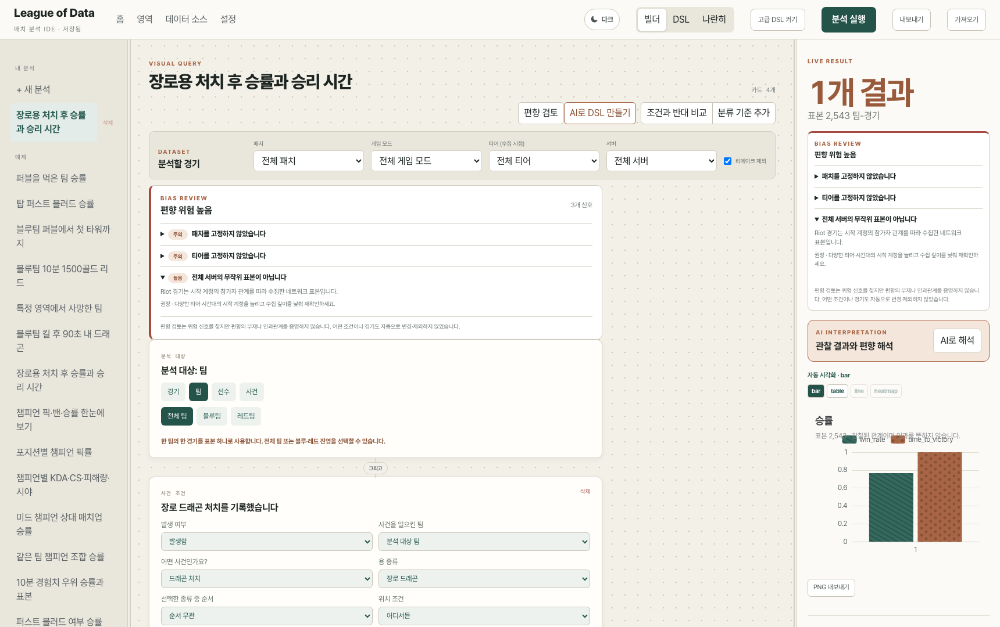
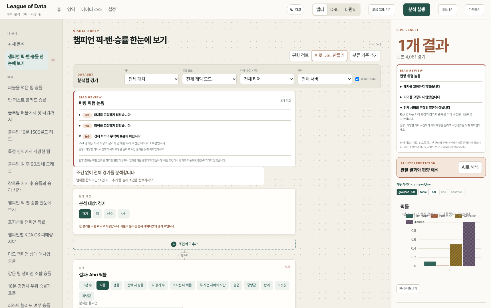
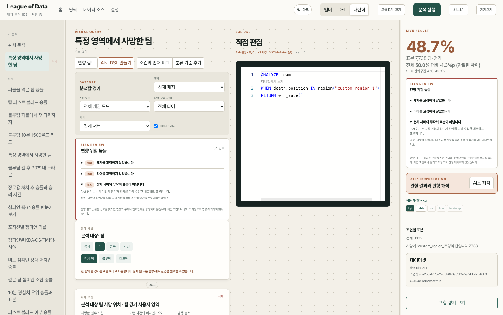

# League of Data

<p align="center">
  <strong>Ask richer questions about League of Legends matches.</strong><br>
  A local-first analytics IDE with a visual query builder, composable DSL, and live DuckDB results.
</p>

<p align="center">
  <a href="https://lod.norhu1130.dev"><strong>Open Public Demo →</strong></a>
</p>

<p align="center">
  <a href="https://lod.norhu1130.dev">
    
  </a>
</p>

League of Data turns LoL questions into reproducible analyses. Build queries with sentence-like
cards or edit the underlying DSL, then inspect results, samples, and bias warnings in one workspace.

- Visual builder and DSL backed by one canonical AST
- Champion, team, objective, event-sequence, spatial, patch, tier, and role analysis
- Bias-aware observational results with baselines and confidence intervals
- Partitioned Parquet execution through FastAPI and DuckDB

## Product tour

<table>
  <tr>
    <td width="50%">
      
      <br><strong>Champion analysis</strong><br>
      Compare picks, bans, and win rates across roles, patches, tiers, and team relations.
    </td>
    <td width="50%">
      
      <br><strong>Visual ↔ DSL</strong><br>
      Move between cards and code without changing the meaning of an analysis.
    </td>
  </tr>
</table>

## Quick start

Requires Node.js 22+, pnpm 10+, Python 3.12+, and
[uv](https://docs.astral.sh/uv/).

```bash
pnpm install && uv sync
pnpm gen:reference
uv run lod-data synth --n 10000 --seed 20260914
pnpm dev
```

Open `http://127.0.0.1:5173`. The API runs on `http://127.0.0.1:8000`.

To serve the restricted, single-process public profile on `127.0.0.1:8000`:

```bash
pnpm public
```

Place an HTTPS reverse proxy or Cloudflare Tunnel in front of this loopback-only service. The
public profile disables administrative and sensitive endpoints, applies conservative resource
limits, and is not a replacement for authentication when access should be restricted.

## Riot data

```bash
export RIOT_API_KEY='...'
uv run lod-data collect --routing asia --puuid '<PUUID>' --count 100
uv run lod-data normalize-riot
uv run lod-data info
```

For network crawling from Riot IDs, normalization behavior, deduplication, and data-quality notes,
see the [data package documentation](packages-py/lod_data/README.md). Riot API keys and generated
datasets are not committed.

## Development

```bash
pnpm typecheck
pnpm test
pnpm test:py
pnpm lint
pnpm test:e2e
```

| Area                       | Documentation                                          |
| -------------------------- | ------------------------------------------------------ |
| Web workspace              | [apps/web](apps/web/README.md)                         |
| TypeScript packages        | [packages](packages/README.md)                         |
| Data ingestion and schemas | [packages-py/lod_data](packages-py/lod_data/README.md) |
| Analytics API              | [services/api](services/api/README.md)                 |
| Benchmarks and tests       | [bench](bench/README.md) · [tests](tests/README.md)    |

## License

Source code is available under the custom
[League of Data Source-Available License 1.0](LICENSE). Noncommercial personal use is permitted;
company, institutional, and commercial use requires Use Case registration and written permission.

## Riot Games notice

League of Data isn't endorsed by Riot Games and doesn't reflect the views or opinions of Riot
Games or anyone officially involved in producing or managing Riot Games properties. Riot Games
and all associated properties are trademarks or registered trademarks of Riot Games, Inc.
