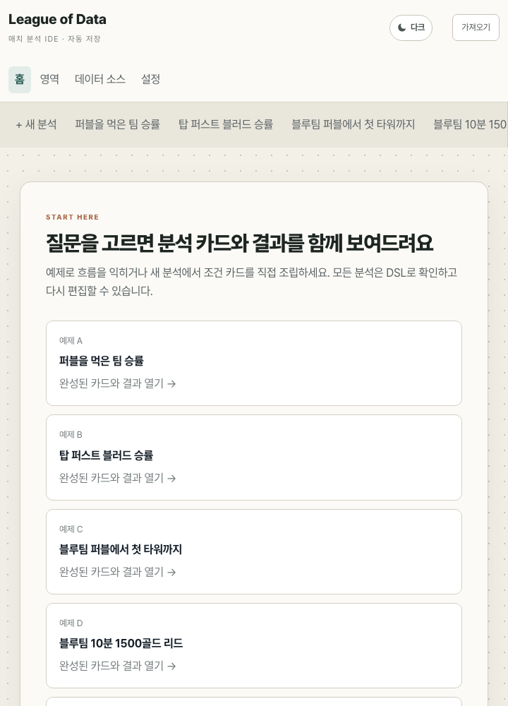

# League of Data

<p align="center">
  <strong>Ask richer questions about League of Legends matches.</strong><br>
  A local-first analytics IDE with a visual query builder, a composable DSL, and live DuckDB results.
</p>

<p align="center">
  
</p>

<p align="center"><sub>Build an analysis from sentence-like cards and inspect the result, sample, and bias warnings in one workspace.</sub></p>

League of Data is not a match-history site or a fixed dashboard. It is an exploratory environment
for turning LoL questions into reproducible analyses:

- **Visual query builder** — assemble readable condition, grouping, and result cards without code
- **Analytics DSL** — inspect or edit the exact declarative query behind every visual analysis
- **Bias-aware results** — surface sampling and interpretation risks next to the numbers
- **Vectorized execution** — analyze partitioned Parquet data through a FastAPI and DuckDB engine

The visual builder and DSL editor share one canonical AST, so switching views never changes the
meaning of an analysis.

## Product tour

<table>
  <tr>
    <td width="50%">
      
      <br><strong>Champion analysis</strong><br>
      Compare pick, ban, and win rates with filters for role, team relation, patch, tier, and game mode.
    </td>
    <td width="50%">
      
      <br><strong>Visual ↔ DSL</strong><br>
      Move between cards and code while preserving the same validated, canonical analysis.
    </td>
  </tr>
</table>

<details>
  <summary><strong>Responsive workspace</strong></summary>
  <br>
  <p align="center">
    
  </p>
  <p align="center"><sub>Navigation and starter analyses remain usable on narrow screens.</sub></p>
</details>

## Quick start

```bash
pnpm install && uv sync
pnpm gen:reference
uv run lod-data synth --n 10000 --seed 20260914
uv run lod-data validate
pnpm dev
```

The web application runs on `http://127.0.0.1:5173` and the API on `http://127.0.0.1:8000`. If data is missing, `/readyz` reports the command required to generate it.

## Public demo profile

The local development server and the public demo are separate commands. Build the web application
and start the restricted, single-process demo server with:

```bash
pnpm public
```

It listens only on `http://127.0.0.1:8000` and serves both the built SPA and API, so the reverse
proxy needs only one loopback upstream. The public profile is selected by the executable and cannot
be enabled through `.env`; `config.toml` is not used. Its public-facing limits and same-origin
request policy take precedence over looser local settings.

This profile disables AI and data-source management, match drill-down, SQL diagnostics, and API
documentation; redacts readiness details; adds API security headers and per-client rate limiting;
and applies conservative concurrency, queue, query-time, DuckDB thread, and memory limits. It also
tells the web app to hide controls for unavailable server capabilities.

Expose it through a same-origin HTTPS reverse proxy. Add Basic Auth, OIDC, or an access gateway at
that edge when the demo should not be open to everyone. Preserve the original `Host` and scheme,
replace rather than append untrusted client forwarding headers, and connect to the upstream through
`127.0.0.1`. The public command reduces the exposed surface but is not an authentication system,
TLS terminator, container sandbox, or persistent distributed rate limiter.

## Optional AI assistance

The application can draft validated DSL and explain completed engine results through OpenRouter.
The default model is `openai/gpt-5.6-luna`. Copy `.env.example` to `.env`, add the key, and restart
the API for persistent configuration. A key entered on the Settings screen is held only in the
local API process memory and is cleared on restart; it is never stored in browser storage.

AI output is advisory. Generated DSL must pass the same parser and semantic validation as manually
written DSL before it can replace the current analysis. Interpretations receive a bounded,
map-point-free result summary and may only describe numbers already computed by the engine.

## Verification

```bash
pnpm typecheck
pnpm test
pnpm test:py
pnpm lint
pnpm check:reference
pnpm test:e2e
uv run python bench/run_bench.py --dataset synth-10k --strict
```

## Riot data

The collector stores Match-V5 responses as compressed bronze data before normalization and resumes interrupted work from a SQLite checkpoint. API keys are accepted only through the environment.

```bash
export RIOT_API_KEY='...'
uv run lod-data collect --routing asia --puuid '<PUUID>' --count 100
uv run lod-data normalize-riot
uv run lod-data info
```

For a bounded breadth-first crawl, put `RIOT_API_KEY` in the gitignored `.env` file and start from
a Riot ID. This example collects ranked solo (420) and Swiftplay (480), discovers the PUUIDs in
each accepted match, and repeats up to the configured player, match, and depth limits:

```bash
uv run lod-data crawl --riot-id 'Hide on bush#KR1' \
  --riot-id 'Example Player#KR1' \
  --queue 420 --queue 480 \
  --matches-per-player 20 --max-players 25 --max-depth 2
```

Crawler normalization runs by default, and the completed-match count is unlimited unless
`--max-matches` is supplied. Surrenders and remakes are excluded before timeline
download and also rejected during normalization. Participant solo-rank entries are captured at
collection time; the match tier used by the IDE is the median of the available participant tiers.
The crawler stores a player-and-queue cursor in `data/bronze/checkpoint.sqlite3`. Repeating the same
command continues with the next Match-V5 page, keeps existing bronze matches, and rebuilds silver
from the complete cumulative bronze collection. Use `tee -a riot-crawl.log` if the crawl log should
also be appended instead of replaced.
Use the crawl limits deliberately: participant expansion is a network crawl and is not a random or
representative sample of the entire regional population.

## Repository map

```text
apps/web              React application and analysis workspace
packages/             TypeScript domain and UI packages
packages-py/lod_data  Parquet schemas, synthetic data, and Riot ingestion
services/api          FastAPI service and DuckDB execution engine
data/                 Generated and collected runtime data
tests/conformance     Shared TypeScript/Python golden cases
tests/e2e             Playwright acceptance tests
bench/                 Performance regression harness
```

Detailed ownership, public APIs, and development commands are documented in each directory:

- [Web application](apps/web/README.md)
- [TypeScript packages](packages/README.md)
- [Python data package](packages-py/lod_data/README.md)
- [Analytics API](services/api/README.md)
- [Runtime data](data/README.md)
- [Benchmarks](bench/README.md)
- [Tests](tests/README.md)

## Core invariants

### Coordinates

Stored and queried coordinates use the game orientation. The y-axis is inverted only when converting to screen pixels. Both axes use the same normalization span so circles remain circles and spatial radii remain meaningful.

### Single semantic sources

Coordinate constants and built-in regions live in `packages/data-model`. Events, functions, diagnostics, and SQL bindings live in `packages/catalog`. Python consumes generated reference artifacts instead of redefining them. `pnpm check:reference` detects drift.

### Canonical AST

Formatting, comments, spans, and redundant parentheses are not semantic state. Every AST producer passes through normalization, and TypeScript and Python must produce identical canonical hashes. The hash keys result caches and drill-down artifacts.

### No arbitrary SQL boundary

The API accepts versioned AST JSON, never arbitrary SQL. SQL is generated only from validated AST nodes and catalog-owned bindings.

### Reproducible synthetic data

Synthetic matches are driven by a latent team-strength variable rather than hard-coded outcomes. A fixed seed produces a stable snapshot, and `lod-data validate` remeasures target metrics directly from generated Parquet files.

### Observational language

Results describe observed associations, include a baseline and confidence interval where applicable, and never claim that a condition caused the outcome.

## License

The source code in this repository is available under the custom
[League of Data Source-Available License 1.0](LICENSE). It permits noncommercial personal use;
company, institutional, and commercial use requires Use Case registration and written permission.
Send the registration request to the licensing email listed in the repository owner's GitHub
profile or repository metadata. If no licensing email is listed, open a GitHub Issue to request a
private contact channel. Riot Games assets and properties remain the property of their respective
owners.

## Riot Games notice

League of Data isn't endorsed by Riot Games and doesn't reflect the views or opinions of Riot
Games or anyone officially involved in producing or managing Riot Games properties. Riot Games,
and all associated properties are trademarks or registered trademarks of Riot Games, Inc.
